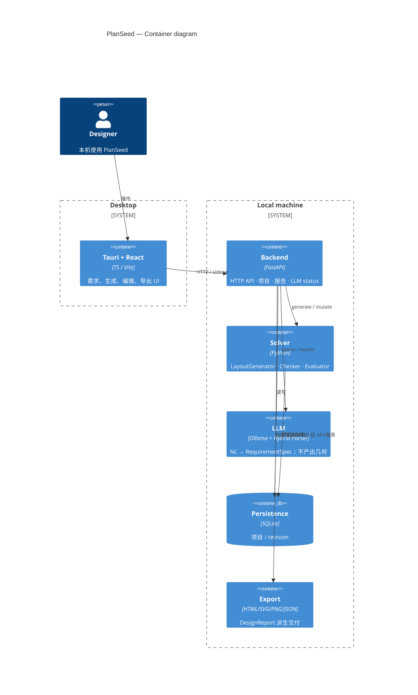
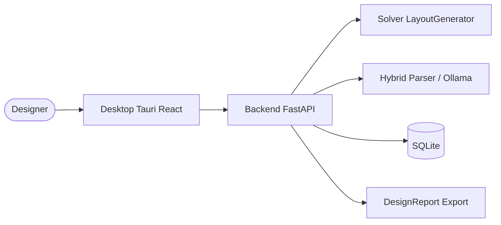

# C4 — PlanSeed（轻量）

容器级视图。细节见 [architecture.md](architecture.md) · 决策见 [adr/](adr/)。

```mermaid
C4Container
    title PlanSeed — Container diagram

    Person(user, "Designer", "本机使用 PlanSeed")

    System_Boundary(desktop_b, "Desktop") {
        Container(ui, "Tauri + React", "TS / Vite", "需求、生成、编辑、导出 UI")
    }

    System_Boundary(local, "Local machine") {
        Container(api, "Backend", "FastAPI", "HTTP API · 项目 · 报告 · LLM status")
        Container(solver, "Solver", "Python", "LayoutGenerator · Checker · Evaluator")
        Container(llm, "LLM", "Ollama + Hybrid Parser", "NL → RequirementSpec；不产出几何")
        ContainerDb(db, "Persistence", "SQLite", "项目 / revision")
        Container(export, "Export", "HTML/SVG/PNG/JSON", "DesignReport 派生交付")
    }

    Rel(user, ui, "操作")
    Rel(ui, api, "HTTP / sidecar")
    Rel(api, solver, "generate / mutate")
    Rel(api, llm, "parse / health")
    Rel(api, db, "读写")
    Rel(api, export, "构建报告与导出")
    Rel(solver, db, "不直接持有；经 API/服务")
```

若渲染器不支持 `C4Container`，可用等价 flowchart：

```mermaid
flowchart LR
  User([Designer]) --> UI[Desktop Tauri React]
  UI --> API[Backend FastAPI]
  API --> Solver[Solver LayoutGenerator]
  API --> LLM[Hybrid Parser / Ollama]
  API --> DB[(SQLite)]
  API --> Export[DesignReport Export]
```
